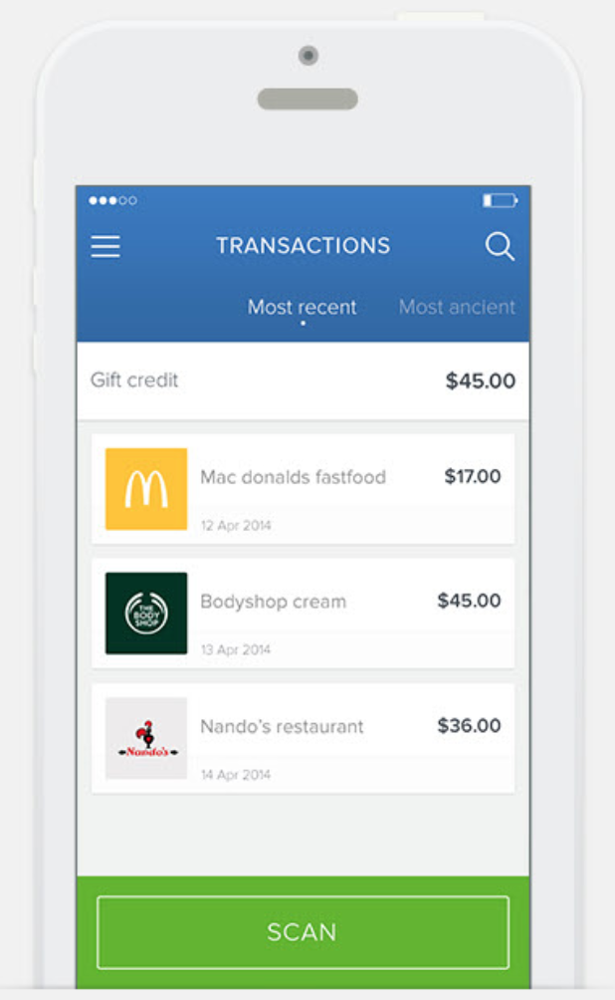
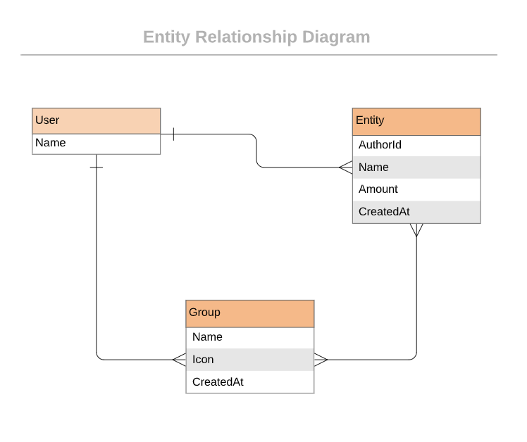

# Backend project - Budget app

## Description

The project is about building a mobile web application where a user can manage budget: they have a list of transactions associated with a category, so that they can see how much money they spent and on what. 

The idea is to create an application that allows the user to:
- register and log in, so that the data is private to them.
- introduce new transactions associated with a category.
- see the money spent on each category.

  

### Project requirements

#### Design
- You should follow these [design guidelines](https://www.behance.net/gallery/19759151/Snapscan-iOs-design-and-branding?tracking_source=), including:
  - Colors.
  - Typography: font face, size and weight.
  - Layout: composition and space between elements.

> NOTE: In these design guidelines there are several UIs that you won't need for this exercise; also, some pages are not given a design and you will create them following the design guidelines of the other pages.

Original design idea by [Gregoire Vella on Behance](https://www.behance.net/gregoirevella).

The [Creative Commons license of the design](https://creativecommons.org/licenses/by-nc/4.0/) requires that you give appropriate credit to the author. Therefore, you must do it in the README of your project.

#### Interactions
- Splash screen
  - A simple page with the name of your app (yes, you need to choose one), and links to the sign up and log in pages.

- Sign up and log in pages
  - The user should be able to register in the app with full name, email and password (all mandatory).
  - The user can log into the app using email and password.
  - If the user is not logged in, they can't access pages that require the user to be logged in (all the pages described below).

- Home page (categories page)
  - When the user logs in, they are presented with the categories page.
  - For each category, the user can see their name, icon and the total amount of all the transactions that belongs to that category.
  - When the user clicks (or taps) on a category item, the application navigates to the transactions page for that category.
  - There is a button "add a new category" at the bottom that brings the user to the page to create a new category.

- Transactions page
  - For a given category, the list of transactions is presented, ordered by the most recent.
  - At the top of the page the user could see the total amount for the category (sum of all of the amounts of the transactions in that category).
  - There is a button "add a new transaction" at the bottom that brings the user to the page to create a new transaction.
  - When the user clicks on the "Back" button (<), the user navigates to the home page.

- "Add a new category" page
  - The user fills out a form to create a new category, indicating their name and icon (both mandatory).
  - The user clicks (or taps) the "Save" button to create the new category, and is taken to the home page on success.
  - When the user clicks on the "Back" button (<), the user navigates to the home page.

- "Add a new transaction" page
  - The user fills out a form to create a new transaction with:
    - name (mandatory)
    - amount (mandatory)
    - categories (mandatory at least one)
  - The user click (or taps) the "Save" button to create the new transaction, and is taken to the transactions page for that category.
  - When the user clicks on the "Back" button (<), the user navigates to the transactions page for that category.

#### Technical requirements

- Used MySql as your database.
- Used devise for authentication.
- Validation of all user input to make sure that anyone with bad intentions cannot compromise your app.
- The project should be deployed and accessible online.
- The database schema reflects the following structure:

  

## Application Development Breakdown:

Steps to complete in the app:
- Set up the repository and tools.
- Create your models according to the ERD diagram.
- Implement the authentication and authorization. 
- Create the page to add a category.
- Create the home page.
- Create the page to add a transaction.
- Create the transactions page.
- Make sure your app is tested adequately.
- Deploy the project, and test for final details.
- Record a video for your project.
- Create a good README and PR description.